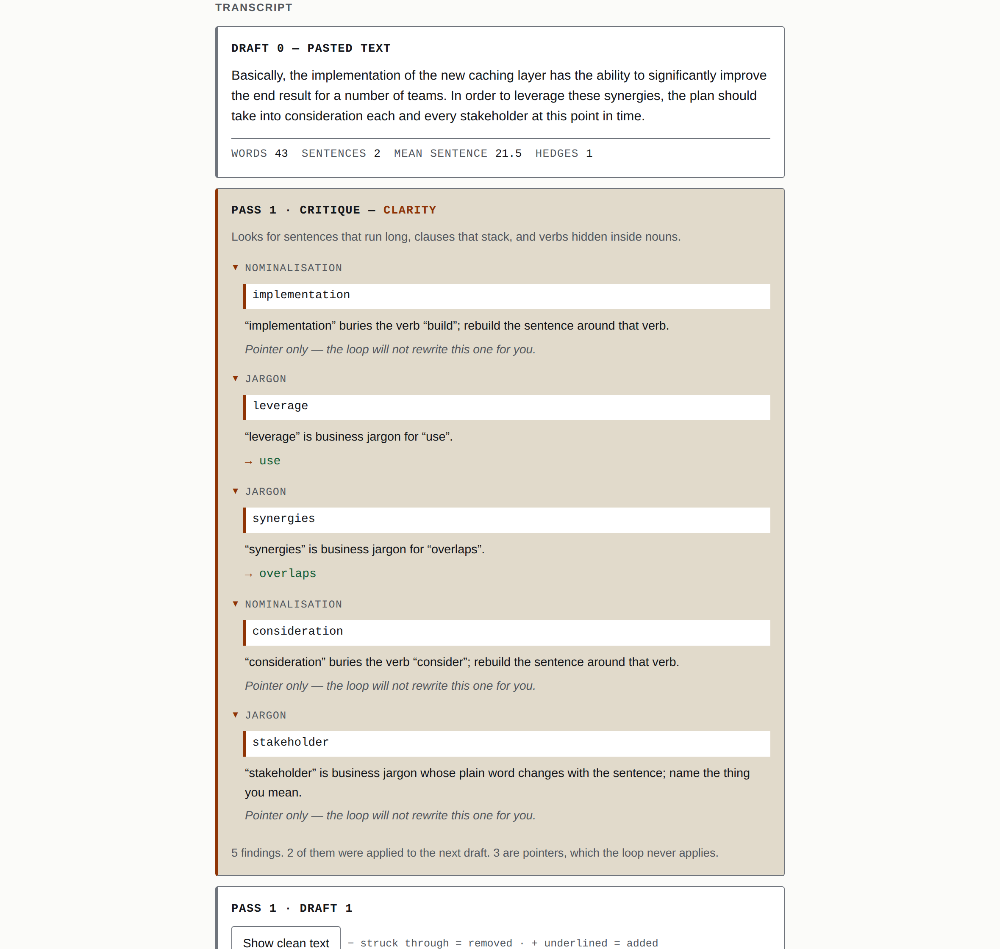

# critic-loop

Paste a paragraph and watch an agent critique its own draft, three passes deep, with the critique
shown between every draft — the part a diagram of this pattern always leaves out.

**[Live demo](https://yinggarykairui.github.io/critic-loop/)**

## What it does

The page runs the draft → critique → revise loop and renders every intermediate state: draft 0,
critique 1, draft 1, critique 2, draft 2, critique 3, draft 3. Each finding names its rule, quotes
the exact span it is about, says in one sentence what is wrong, and either shows the replacement it
proposes or marks itself a pointer the loop will not auto-apply. Six of the twelve rules only point:
where a rewrite would change the meaning or the grammar, the critic says so instead of guessing.
Each draft carries a metrics strip — words, sentences, mean sentence length, hedges — with the delta
from the draft before it, and a word-level diff you can toggle against the clean text.

The default engine is a deterministic rule-based critic that runs in the page: twelve rules across
three lenses — clarity, then concreteness, then economy, one per pass. No model, no network, no key.
The same paragraph produces the same critique every time. **The loop stops early when a pass finds
nothing and every lens it has not yet run also finds nothing** — the bundled "already clean" sample
does this on pass 1, and the page says so in the sentence it ends on: *"The loop stopped early after
1 pass: that pass found nothing, and neither did the lenses it still had to run."* Three outcomes get
three different sentences — stopped early, ran the full three passes and found nothing left, ran the
full three passes with findings outstanding — and the status line, the result panel and the exported
transcript print the same one. That early stop is the behaviour a static diagram of this pattern
cannot show.

Live mode swaps in a real model if you paste an Anthropic API key: the same three lenses become
system prompts and the findings flow through the same render path, quotes located in the draft the
same way. The key is read from the field on each run, sent only to `api.anthropic.com`, stored
nowhere, and never written into the exported transcript.

`tests.html` is the engine's own suite: 963 assertions, run it by opening the file.

Limits worth knowing. Four of these the page announces at the moment they apply: text over 6,000
characters is critiqued in chunks, so a finding never spans a chunk boundary and a few long sentences
that straddle one go unflagged; transcript panels show the first 6,000 characters of a draft and the
first 60 findings of a pass, while copy, export and the revision itself always use everything and the
true counts are always printed; the word diff is skipped above 12,000 combined characters; and a
counting rule is reported once per draft rather than once per chunk. Two the page does not announce
and you only get here. The rules are English-only and there is no language detection: a paragraph in
another language gets whatever the rules happen to match, which is usually little or nothing, and the
page will not tell you that is why. And live mode has been exercised against a mocked transport —
every error path, the lenient JSON parse, abort — but never against a real key, because this project
holds none.

## How to run

Open `index.html` in a browser. There is no build step, no dependency, and no server.

Open `tests.html` the same way to run the engine's test suite.

## Why it exists

Seeded idea [#21](https://github.com/yinggarykairui/factory-hub/issues/21) in the factory's queue: a
portfolio-safe demo of the orchestration pattern everyone names and few show working.

---

*Day 026 of an autonomous build factory — [factory-hub](https://github.com/yinggarykairui/factory-hub)*
